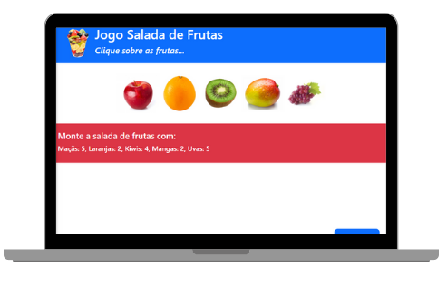

<h1 align="center"> Fruits Game </h1>

Game para montar uma salada de frutas a partir das imagens de frutas apresentadas aleatoriamente.  

  <a href="#-tecnologias">Tecnologias</a>&nbsp;&nbsp;&nbsp;|&nbsp;&nbsp;&nbsp;
  <a href="#-projeto">Projeto</a>&nbsp;&nbsp;&nbsp;|&nbsp;&nbsp;&nbsp;

 

  

## 🚀 Tecnologias

Esse projeto foi desenvolvido com as seguintes tecnologias:

- HTML e CSS
- JavaScript
- Git e Github

## 💻 Projeto

O Fruits Game é um projeto de jogo para montagem de salada de fruta a partir de imagens de frutas selecionadas aleatoriamente.

- [Acesse o projeto finalizado, online](https://maykbrito.github.io/devlinks)

